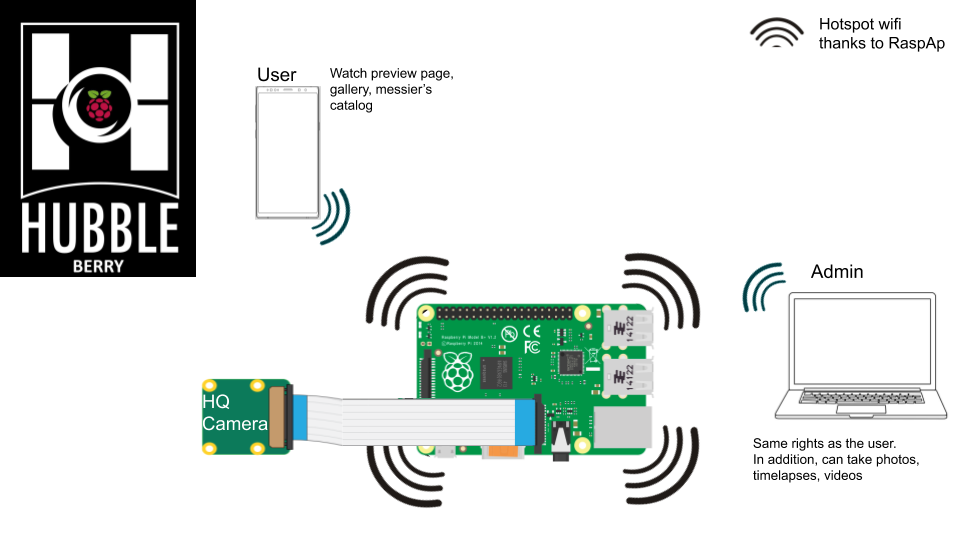
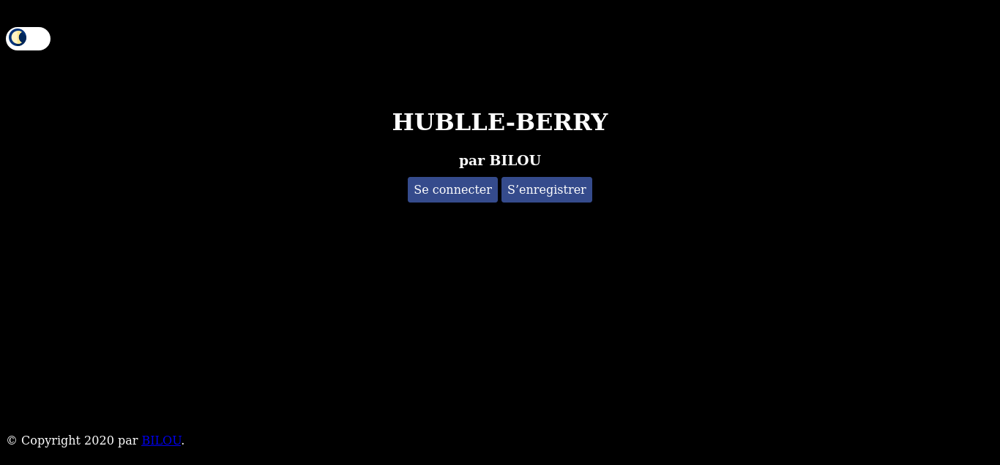

# Hubble-Berry 


I wanted to start Astrophotography and the HQ pi camera was just announced. Thus I decided to create a website to manage this camera easily and let others access some pages as a Gallery.
Hubble-Berry is my first contribution to the Open Source world, do not hesitate to suggest improvements on the code, the documentation or features.

## Getting Started

These instructions will get you a copy of the project up and running on your local machine for development and testing purposes. See deployment for notes on how to deploy the project on a live system.

### Prerequisites

Here is what I used to make this project:
+ Raspberry PI model 3B [[1]](#1)
+ Raspberry PI HQ Camera [[2]](#2)
+ RaspAp [[3]](#3)
+ Activate the camera module (required) and SSH (optionnal but it's easier to control) on your Raspberry PI
+ USB key named 'HUBBLE_SAVE' and with the following organization (only if you want to save your files on a USB key. You can also use `./scripts/download.py` to download from another computer.):
    ```bash
    .
    ├── camera
    │   ├── pictures
    │   ├── timelapse
    │   ├── video

    ```





### Installing

+ After cloning the project, go inside the directory `cd hubble-berry`.
+ If virtualenv is not installed on your rpi `sudo pip install virtualenv`
+ create a virtual environment `virtualenv hubble-berry-project`
+ Activate the environment `. activate`
+ Execute the installation file `./installation.sh`
+ To finish, you can start the application

```sh
FLASK_APP=main.py FLASK_ENV=development flask run --port 8000 --with-threads # just on localhost
FLASK_APP=main.py FLASK_ENV=development flask run --port 8000 --host=0.0.0.0 --with-threads # to all active interfaces
```

if everything worked properly, you should be able to reach the first page.



+ To leave the virtual environment `deactivate`
+ If you are using vscode and there is a problem with the virtual environment https://stackoverflow.com/questions/54106071/how-to-setup-virtual-environment-for-python-in-vs-code

## Deployment

Add additional notes about how to deploy this on a live system

## Built With

    Flask - The web framework used
    picamera - A pure Python interface to the Raspberry Pi camera module 

## Contributing

Please read CONTRIBUTING.md for details on our code of conduct, and the process for submitting pull requests to us.

<!-- TODO -->
<!-- ## Versioning

We use SemVer for versioning. For the versions available, see the tags on this repository. -->

## Authors

    Bilou4 - Initial work

<!-- See also the list of contributors who participated in this project. -->

## License

This project is licensed under the GPL License - see the COPYING file for details

## Acknowledgments

+ Miguel Grinberg - Flask Tutorial - https://blog.miguelgrinberg.com/post/the-flask-mega-tutorial-part-i-hello-world
+ Miguel Grinberg - Stream Video with Flask - https://blog.miguelgrinberg.com/post/video-streaming-with-flask
+ https://galleriajs.github.io/
+ Astrosurf - http://www.astrosurf.com/luxorion/Images/messier-catalog-mike-keith.jpg
+ Ligo Easter Egg - https://www.ligo.caltech.edu/video/ligo20160211v2
+ Python Logger - https://medium.com/@galea/python-logging-example-with-color-formatting-file-handlers-6ee21d363184
+ RaspAp WebGUI - https://github.com/billz/raspap-webgui
+ USB key on Rpi - https://www.raspberrypi-spy.co.uk/2014/05/how-to-mount-a-usb-flash-disk-on-the-raspberry-pi/
+ Picamera's documentation - https://picamera.readthedocs.io/en/release-1.13/


## References

<a id="1">[1]</a> https://www.raspberrypi.org/products/raspberry-pi-3-model-b/

<a id="2">[2]</a> https://www.raspberrypi.org/products/raspberry-pi-high-quality-camera/

<a id="3">[3]</a> https://github.com/billz/raspap-webgui