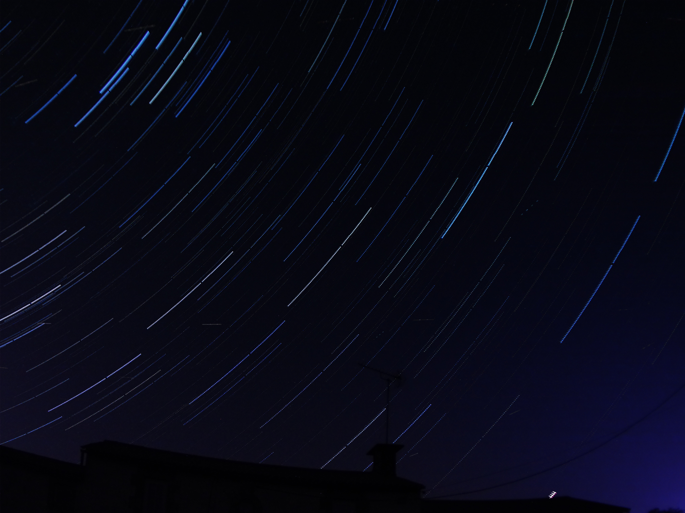

# Hubble-Berry 



<br>

Here is an example of a photo taken thanks to Hubble-Berry. More examples in 
`./appFolder/static/camera`
<br><br>

I wanted to start Astrophotography and the HQ pi camera had just been marketed. Thus, I decided to create a website to manage this camera easily and let others access some pages as a Gallery.
Hubble-Berry is my first contribution to the Open Source world, so do not hesitate to suggest any improvements on the code, the documentation or features.

<hr>

## Getting Started

These instructions will get you a copy of the project up and running on your local machine for development and testing purposes. See deployment for notes on how to deploy the project on a live system.

<br>

### Prerequisites

Here is what I used to make this project:
+ Raspberry PI model 3B [[1]](#1)
+ Raspberry PI HQ Camera [[2]](#2)
+ RaspAp [[3]](#3)
+ Activate the camera module (required) and SSH (optionnal but it's easier to control) on your Raspberry PI
+ USB key named 'HUBBLE_SAVE' and with the following organization (only if you want to save your files on a USB key. You can also use `./scripts/download.py` to download from another computer.):
    ```bash
    .
    ├── camera
    │   ├── pictures
    │   ├── timelapse
    │   ├── video
    ```


<br>

### Installing

+ After cloning the project, go into the directory `cd hubble-berry`.
+ If virtualenv is not installed on your Raspberry PI `pip3 install virtualenv`
+ create a virtual environment (your python version must be greater than 3.6) `virtualenv --python=/usr/local/bin/python3.7 hubble-berry-project`
+ Activate the environment `. activate`
+ Execute the installation file `./installation.sh`
+ To finish, you can start the application

```sh
FLASK_APP=main.py FLASK_ENV=development flask run --port 8000 --with-threads # just on localhost
FLASK_APP=main.py FLASK_ENV=development flask run --port 8000 --host=0.0.0.0 --with-threads # to all active interfaces
```

if everything worked properly, you should be able to reach the first page.


+ To leave the virtual environment `deactivate`
+ If you are using vscode and there is a problem with the virtual environment https://stackoverflow.com/questions/54106071/how-to-setup-virtual-environment-for-python-in-vs-code

<hr>

## Deployment

<!-- Add additional notes about how to deploy this on a live system -->

<hr>

## Built With

    Flask - The web framework used
    picamera - A pure Python interface to the Raspberry Pi camera module 

<hr>

## Contributing

Please read CONTRIBUTING.md for details on our code of conduct, and the process to submit us pull requests.

<!-- TODO -->
<!-- ## Versioning

We use SemVer for versioning. For the versions available, see the tags on this repository. -->

<hr>

## Authors

    Bilou4 - Initial work

<!-- See also the list of contributors who participated in this project. -->

<hr>

## TODO List

| Task name | Description |
|-----------|-------------|
|Production server|Instead of Flask development server, use a [server] that can run on Raspberry PI|
|Automate prod server usage   	|Create a script to deploy new versions of the application and to set up the server easily 	|
|Exposure time timelapse | Allow the user to anticipate a longer exposure time after a certain runtime (or number of photos - maybe easier)

<hr>

## License

This project is licensed under the GPL License - see the COPYING file for details

<hr>

## Acknowledgments

+ Miguel Grinberg - Flask Tutorial - https://blog.miguelgrinberg.com/post/the-flask-mega-tutorial-part-i-hello-world
+ Miguel Grinberg - Stream Video with Flask - https://blog.miguelgrinberg.com/post/video-streaming-with-flask
+ Galleria - create a Gallery page - https://galleriajs.github.io/
+ Astrosurf - Messier catalog - http://www.astrosurf.com/luxorion/Images/messier-catalog-mike-keith.jpg
+ Ligo Easter Egg - The Sound of Two Black Holes Colliding - https://www.ligo.caltech.edu/video/ligo20160211v2
+ Python Logger - https://medium.com/@galea/python-logging-example-with-color-formatting-file-handlers-6ee21d363184
+ RaspAp WebGUI - Hotspot wifi - https://github.com/billz/raspap-webgui
+ USB key on Raspberry PI - Script to mount USB key - https://www.raspberrypi-spy.co.uk/2014/05/how-to-mount-a-usb-flash-disk-on-the-raspberry-pi/
+ Picamera's documentation - https://picamera.readthedocs.io/en/release-1.13/

<hr>

## References

<a id="1">[1]</a> https://www.raspberrypi.org/products/raspberry-pi-3-model-b/

<a id="2">[2]</a> https://www.raspberrypi.org/products/raspberry-pi-high-quality-camera/

<a id="3">[3]</a> https://github.com/billz/raspap-webgui

[server]:https://blog.miguelgrinberg.com/post/the-flask-mega-tutorial-part-xvii-deployment-on-linux