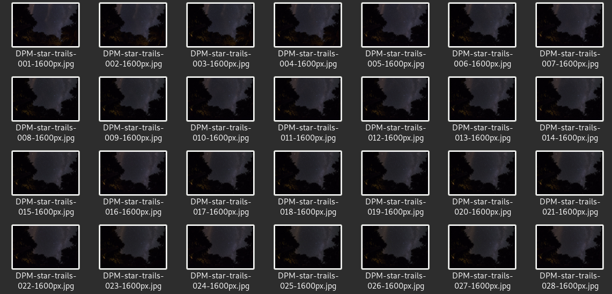
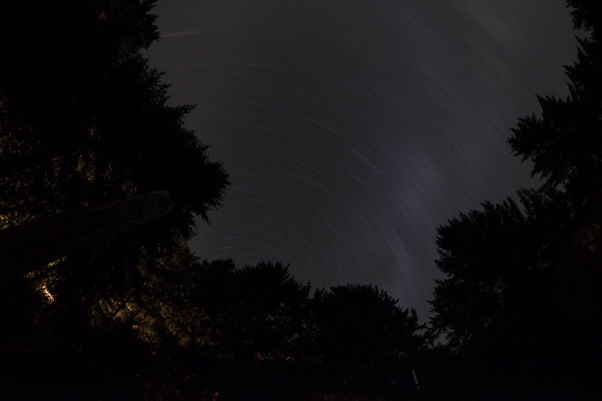
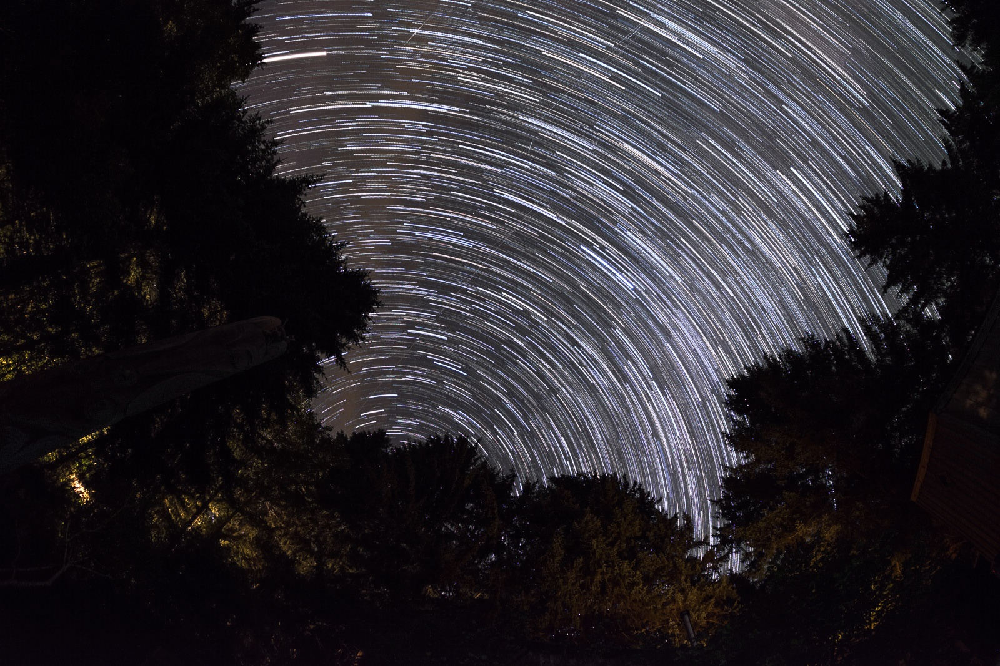

# Hubble-Berry Tools

This CLI helps you to interact with the berry-box by retrieving some files easily. It also provides you with commands to help you modify, convert and process your images.

## Commands

### copy-images

This command allows you to copy to another computer, files that are on the berry-box. You can precise which folder: video/timelapse/pictures.

```sh
Usage: hubble-berry copy-images [OPTIONS]

  Retrieve images from your berry-box by copying them.

Options:
  -v, --videos      If your demand concerns videos.
  -t, --timelapses  If your demand concerns timelapses.
  -p, --pictures    If your demand concerns pictures.
  --help            Show this message and exit.
```

### move-images

The same as `copy-images` but by moving them.

```sh
Usage: hubble-berry move-images [OPTIONS]

  Retrieve images from your berry-box by moving them.

Options:
  -v, --videos      If your demand concerns videos.
  -t, --timelapses  If your demand concerns timelapses.
  -p, --pictures    If your demand concerns pictures.
  --help            Show this message and exit.
```

### extract-video-frames

Thanks to a video in input, you can extract all images to an output directory.

```sh
Usage: hubble-berry extract-video-frames [OPTIONS]

  Extract all images from a video.

Options:
  -i, --input FILE        The input video.
  -o, --output DIRECTORY  The output directory containing converted photos.
  --help                  Show this message and exit.
```

### raw-to-jpg

This script will help you convert your RAW files to JPG image. You can choose the compression rate between [0;100] (Higher is the value, better is the quality. Default=85).
You need to have [ufraw] installed on your computer.

```sh
Usage: hubble-berry raw-to-jpg [OPTIONS]

  Tool to convert RAW images to JPG.

Options:
  -i, --input DIRECTORY           The input directory containing photos.
  -o, --output DIRECTORY          The output directory containing converted
                                  photos.
  -c, --compression INTEGER RANGE
                                  The compression rate of the jpg image. The
                                  compression rate must be between 0 and 100.
                                  Higher is the value, better is the quality.
                                  [default: 85; 0<=x<=100]
  --help                          Show this message and exit.
```

### star-trail

```sh
Usage: hubble-berry star-trail [OPTIONS]

  Create a Star Trail by averaging or maximizing stars on the final image.

Options:
  -i, --input DIRECTORY   The input directory containing photos.
  -o, --output DIRECTORY  The output directory containing converted photos.
  --avg                   Method used to create the star trail (default: max).
  --help                  Show this message and exit.
```

I used Darlene's [[1]](#1) sample pictures to test my script.

First, you have your sample photos.


Then, you run the command with valid options and the method you want.


Here is an example when averaging pixels.

Result :


Here, it's when you use default configuration, maximum pixels (without --avg).



### timelapse

```sh
Usage: hubble-berry timelapse [OPTIONS]

  Create a timelapse by merging all images from an input directory.

Options:
  -i, --input DIRECTORY   The input directory containing photos.
  -o, --output DIRECTORY  The output directory containing converted photos.
  -t, --time FLOAT        Time for the duration of a frame in the final video.
  --mp4                   The format you want for the video (default: avi)
  --help                  Show this message and exit.
```

There are 2 available formats at this moment, AVI and MP4. AVI is the default one, if you want MP4, just add --mp4 in the command line. Here is an example: [timelapse_example]


## References

<a id="1">[1]</a> https://www.digitalphotomentor.com/how-to-shoot-star-trails-and-sample-images-for-you-to-practice-stacking/

[ufraw]:https://doc.ubuntu-fr.org/ufraw
[timelapse_example]:https://github.com/Bilou4/hubble-berry/blob/master/appFolder/static/camera/video/2020-09-11-22-12-01.mp4