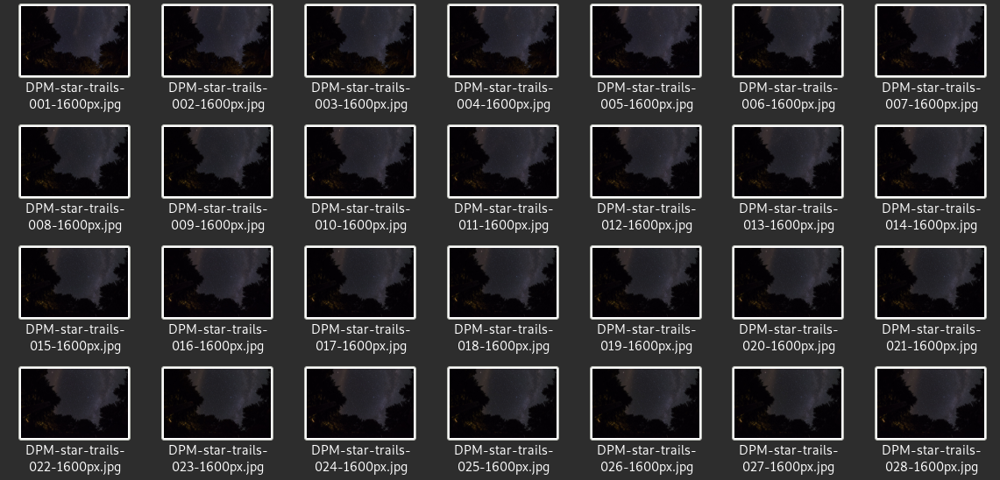
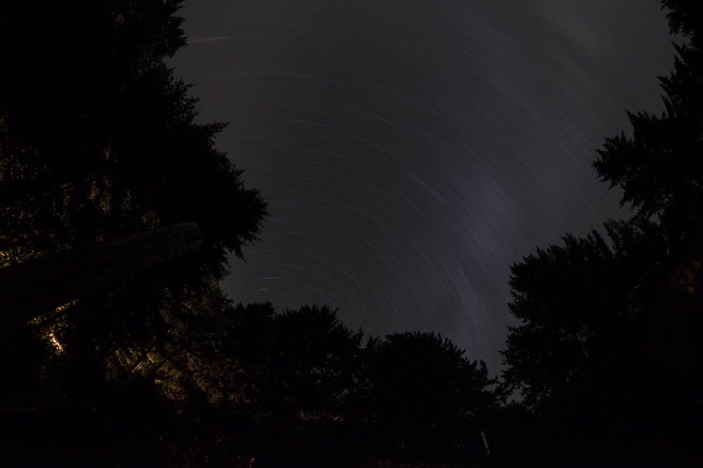
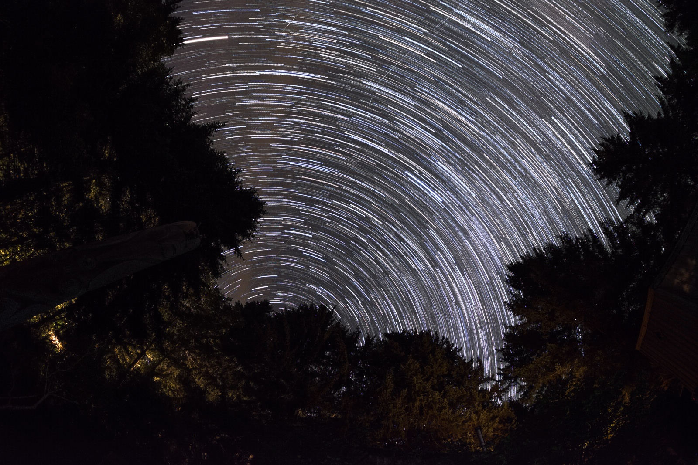

# Scripts

This folder helps you to interact with the berry-box by retrieving some files easily. It also provides you with scripts to help you modify, convert and process your images.

## download.py

This script allows you to download from another computer, files that are on the berry-box. You can choose to copy or move them. You can precise which folder: video/timelapse/pictures.

```sh
./download.py -move -v -t -p
```

```sh
./download.py -copy -v -t -p
```

## starTrail.py

I used Darlene's [[1]](#1) sample pictures to test my script.

First, you have your sample photos.


Then, you run the command with valid options and the method you want.


Here is an example when averaging pixels.

```sh
./startTrail.py -i [input_directory] -o [output_directory] --avg
```
Result :


Here, it's when you use default configuration, maximum pixels (without --avg).


## pylapse.py

There are 2 available formats at this moment, AVI and MP4. AVI is the default one, if you want MP4, just add --mp4 in the command line.

```sh
./pylapse.py -i [input_directory] -o [output_directory] -t [time]
```

## extractImageFromVideo.py

Thanks to a video in input, you can extract all images to an output.

```sh
./extractImageFromVideo.py -i [input_directory] -o [output_directory]
```

## fromRawToJPG.py

This script will help you convert your RAW files to JPG image. You can choose the compression rate between [0;100] (Higher is the value, better is the quality. Default=85).
You need to have [ufraw] installed on your computer.

```sh
./fromRawToJPG.py -i [input_directory] -o [output_directory] -c [rate_compression]
```

## References

<a id="1">[1]</a> https://www.digitalphotomentor.com/how-to-shoot-star-trails-and-sample-images-for-you-to-practice-stacking/

[ufraw]:https://doc.ubuntu-fr.org/ufraw